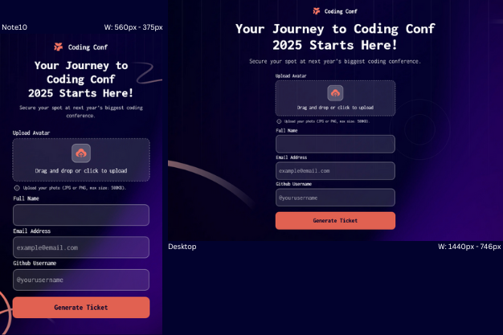

# Frontend Mentor - Conference ticket generator solution

This is a solution to the [Conference ticket generator challenge on Frontend Mentor](https://www.frontendmentor.io/challenges/conference-ticket-generator-oq5gFIU12w)

## Table of contents

- [Overview](#overview)
- [The challenge](#the-challenge)
- [Screenshot](#screenshot)
- [Links](#links)
- [Tech Stack](#tech-stack)
- [What I learned](#what-i-learned)
- [Continued Development](#continued-development)
- [Useful Resources](#useful-resources)
- [Developer](#developer)

## Overview

### The challenge

Users should be able to:

- Complete the form with their details
- Receive form validation messages if:
  - Any field is missed
  - The email address is not formatted correctly
  - The avatar upload is too big or the wrong image format
- Complete the form only using their keyboard
- Have inputs, form field hints, and error messages announced on their screen reader
- See the generated conference ticket when they successfully submit the form
- View the optimal layout for the interface depending on their device's screen size
- See hover and focus states for all interactive elements on the page

### Screenshot

### Links

  

### Tech Stack

- HTML5
- CSS
- Flexbox
- CSS Grid
- Framer Motion
- React hook forms
- [React](https://reactjs.org/) - JS library

### What I learned

While developing the Ticket Generator App, I gained insight into a few advanced React concepts and libraries. I integrated React Hook Form to manage user inputs efficiently. This library simplifies form validation by leveraging React hooks, allowing for cleaner and more maintainable code. By using the useForm hook, I could register input fields and define validation rules effortlessly.

To enhance the app's interactivity, I used Framer Motion, a powerful animation library for React. Specifically, I utilized the motion component to animate elements and AnimatePresence to handle the transition of components entering and exiting the DOM. This allowed for smooth animations during component transitions, improving the visual flow of the application.

This project marked my first substantial use of the useContext hook for state management in a React application. By creating a context provider, I could share state across multiple components without resorting to prop drilling. This approach streamlined data flow and made the codebase more modular and easier to maintain.

Collectively, these experiences have deepened my understanding of form handling, animations, and state management in React, equipping me with tools to build more dynamic and user-friendly applications.

### Continued development

In future projects, I intend to write my React applications using TypeScript to gain a better understanding of the style and add it to my stack. I will also dive deeper into UI interactivity and how it creates a better user experience overall.

### Useful resources

- [A Better Guide to Forms in React - Andrew Jones](https://dev.to/ajones_codes/a-better-guide-to-forms-in-react-47f0?utm_source=pocket_shared) - This article provided valuable insights into managing forms in React, helping me better understand the differences between controlled and uncontrolled components. It reinforced best practices for handling dynamic forms and optimizing performance, which I applied while using react-hook-form to streamline form validation in this project.

- [React Hook Form - Complete Tutorial - Cosden Solutions](https://www.youtube.com/watch?v=cc_xmawJ8Kg) - This video taught me what I needed to know to implement React Hook Forms in this project.

## 👩‍💻 Developer

 
